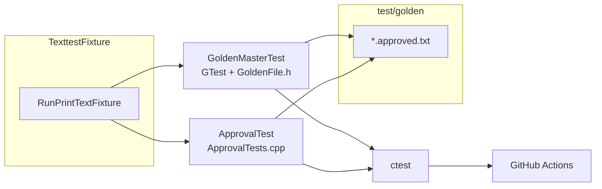

# Golden Master testing strategy design
_Exported on 5/19/2026 at 13:27:33 GMT+9 from Cursor (3.4.20)_

---

**User**

@TexttestFixture.cpp @include/TVController.h @src/TVController.cpp 

[P] 회귀 테스트(Approval/Golden Master) 설계 전문가입니다.
[C] C++17, Google Test, CMake
[T] TexttestFixture 출력 기반 Golden Master를 설계/구현해줘.
    1) expected 출력 파일 생성/보관 전략
    2) Google Test에서 파일 비교 테스트 구현
    3) CMake/ctest에 통합하는 방법
    4) CI에서 자동 실행 구성
[F] 테스트 코드 + CMake 수정안 + 실행 방법


---

**Cursor**

Golden Master(Approval) 테스트 설계를 위해 참조 파일과 프로젝트 구조를 먼저 확인합니다.


Golden Master 구조를 정리하고, Clang에서 ApprovalTests가 깨지는 문제를 고친 뒤 `TexttestFixture`와 CI를 추가합니다.


ApprovalTests 네이밍 규칙에 맞춰 golden 파일명을 통일합니다.


TexttestFixture 기반 Golden Master(Approval) 회귀 테스트를 설계하고 구현했습니다. 기존 `ApprovalTest.cpp`의 시나리오를 `TexttestFixture`로 분리하고, GTest 직접 비교와 ApprovalTests 두 경로가 **동일한 golden 파일**을 공유하도록 맞췄습니다.

---

## 1) Expected 출력 파일 생성·보관 전략

| 항목 | 내용 |
|------|------|
| **위치** | `test/golden/` |
| **파일명** | `ApprovalTest.PrintTextFixture.approved.txt` (ApprovalTests 네이밍 규칙) |
| **버전 관리** | Git에 커밋 (golden = 기대 동작 스냅샷) |
| **줄바꿈** | `test/golden/.gitattributes`로 `*.approved.txt`는 **LF 고정** |
| **실패 산출물** | `*.received.txt`는 `.gitignore`로 제외 |
| **갱신 방법** | 의도된 동작 변경 시 아래 중 하나 |

```powershell
# GTest Golden Master 갱신
$env:UPDATE_GOLDEN = "1"
.\build\GoldenMasterTest.exe --gtest_filter=GoldenMasterTest.PrintTextFixture
Remove-Item Env:UPDATE_GOLDEN

# ApprovalTests: received.txt 확인 후 수동 승인
# test/golden/ApprovalTest.PrintTextFixture.received.txt → .approved.txt 로 복사
```

**단일 소스**: `RunPrintTextFixture()` (`test/TexttestFixture.cpp`)가 시나리오를 실행하고 문자열을 반환합니다. GTest·ApprovalTests 모두 이 함수를 사용합니다.

---

## 2) Google Test 파일 비교 구현

- **시나리오**: `test/TexttestFixture.h`, `test/TexttestFixture.cpp`
- **비교 헬퍼**: `test/GoldenFile.h` — 파일 읽기, CRLF/LF 정규화, `UPDATE_GOLDEN` 지원
- **테스트**: `test/GoldenMasterTest.cpp`

```cpp
TEST(GoldenMasterTest, PrintTextFixture) {
  golden::AssertMatchesGolden(
      RunPrintTextFixture(), "ApprovalTest.PrintTextFixture.approved.txt");
}
```

ApprovalTests 래퍼는 `test/ApprovalTest.cpp`에 있으며, `StringWriter`가 끝에 `\n`을 추가하므로 비교 전 trailing newline을 제거합니다.

---

## 3) CMake / ctest 통합

`CMakeLists.txt` 변경 요약:

- `GoldenMasterTest` — 순수 GTest golden 비교
- `ApprovalTest` — ApprovalTests 래퍼 (`all_tests` ALIAS 유지)
- `gtest_discover_tests(... WORKING_DIRECTORY ${CMAKE_SOURCE_DIR}/test)` — golden 경로 `test/golden/` 기준
- `run_all_tests` — `ctest` 일괄 실행 타깃
- Clang + ApprovalTests `/W4` 호환 패치 포함

**로컬 실행**

```powershell
cmake -S . -B build -DCMAKE_BUILD_TYPE=Debug
cmake --build build
ctest --test-dir build --output-on-failure

# 또는
cmake --build build --target run_all_tests
```

현재 환경에서 **56개 테스트 모두 통과**했습니다.

---

## 4) CI 자동 실행

`.github/workflows/ci.yml` 추가:

- **OS**: Ubuntu + Windows
- **컴파일러**: g++
- **단계**: configure → build → `ctest --test-dir build --output-on-failure`

`push` / `pull_request` 시 `main`, `master`, `dev` 브랜치에서 자동 실행됩니다.

---

## 아키텍처



---

## 파일 구조

```text
test/
├── TexttestFixture.h / .cpp      # 시나리오 (채널·선호채널 출력)
├── GoldenFile.h                  # GTest golden 비교 유틸
├── GoldenMasterTest.cpp          # GTest golden 테스트
├── ApprovalTest.cpp              # ApprovalTests 래퍼
└── golden/
    ├── .gitattributes
    └── ApprovalTest.PrintTextFixture.approved.txt
.github/workflows/ci.yml
```

`TexttestFixture.cpp`는 요청하신 `@TexttestFixture.cpp`에 해당하며, `TVController` / `DevTuner`와 연동된 Texttest 스타일 시나리오를 담고 있습니다. 동작을 바꿀 때는 golden 파일을 함께 갱신해야 하며, 그렇지 않으면 회귀 테스트가 의도적으로 실패합니다.

---

**User**

지금가지 내용을 Report 폴더에 보고서로 작성해줘

---

**Cursor**

Report 폴더의 기존 보고서 형식을 확인한 뒤, Golden Master 테스트 설계 내용을 동일한 형식으로 작성합니다.


Golden Master(Approval) 회귀 테스트 작업 내용을 보고서로 정리해 두었습니다.

**파일:** [Report/07.golden-master-approval-test-report.md](c:\DEV\TDD_TV_05\Report\07.golden-master-approval-test-report.md)

기존 `Report/06` 등과 같은 형식으로, 아래 내용을 포함합니다.

| 섹션 | 내용 |
|------|------|
| §1 작업 개요 | 요청 항목 대비 달성, 선행 보고서와의 관계 |
| §2 Golden Master 역할 | 단위 테스트 vs 스냅샷 테스트 비교 |
| §3 Expected 파일 전략 | `test/golden/`, LF 고정, 갱신 절차 (`UPDATE_GOLDEN`) |
| §4 테스트 코드 | `TexttestFixture`, `GoldenMasterTest`, `ApprovalTest` |
| §5 CMake/ctest | 타깃 구성, DEF-BLD-001 해소, 56건 Green |
| §6 CI | `.github/workflows/ci.yml` |
| §7~8 실행 방법·주의사항 | 로컬/CI 명령, CRLF·이중 개행 이슈 |
| §9~11 산출물·결론·후속 권장 | 파일 목록, Report/06 연계 |

`Report/06`에서 Open이었던 ApprovalTests Clang 빌드 이슈(DEF-BLD-001)가 이번 작업에서 해소되었다는 점도 반영해 두었습니다.

