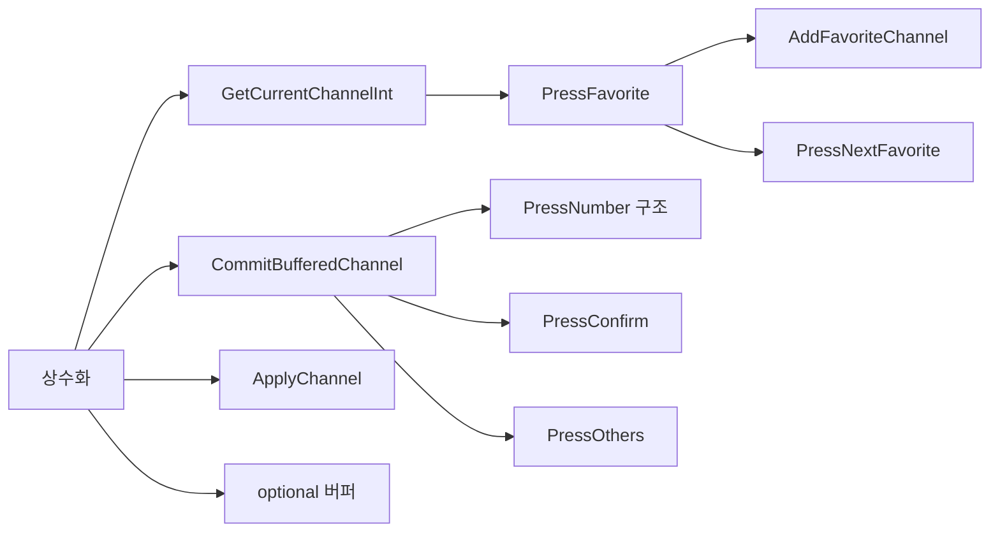

# TVController refactoring plan
_Exported on 5/19/2026 at 13:34:51 GMT+9 from Cursor (3.4.20)_

---

**User**

@include/TVController.h @src/TVController.cpp @docs/code_quality_report.md @docs/requirements_analysis.md 

[P] 모던 C++ 리팩토링 코치입니다.
[C] 제약: Tuner.h, remoteKey.h 구조체 수정 금지, channel 0~99, 테스트 Green에서만 진행
[T] @src/TVController.cpp  각 메소드의 팩토링 계획을 단계별로 제안해줘.
    - 조건 분기 축소/중복 제거 (커밋 단위로 쪼개기)
    - 타입/정책 분리 (전략 패턴/테이블 기반/함수 분해)
    - 매직 넘버 상수화와 C++17 스타일 개선
[F] 단계별 체크리스트 + 각 단계 검증 방법 (cmake --build && ctest)


---

**Cursor**

리팩토링 계획을 제안하기 위해 참조 파일과 테스트 구조를 확인합니다.


현재 **56/56 테스트 Green** 기준으로, `TVController` 메서드별 리팩토링 로드맵입니다.  
제약(`Tuner.h` / `remoteKey.h` 구조체 미수정, 채널 0~99, 커밋마다 Green)을 전제로 했습니다.

---

## 공통: 베이스라인 & 검증 명령

**시작 전 (Phase 0)**

| # | 작업 | 완료 기준 |
|---|------|-----------|
| 0.1 | `build` 디렉터리에서 빌드·테스트 Green 확인 | 56 tests passed |
| 0.2 | 변경 범위 고정: `include/TVController.h`, `src/TVController.cpp` (+ 필요 시 `include/TVConstants.h` 신규) | `Tuner.h`, `remoteKey.h` diff 없음 |

```powershell
cmake --build c:\DEV\TDD_TV_05\build
ctest --test-dir c:\DEV\TDD_TV_05\build --output-on-failure
```

또는: `cmake --build build; ctest --test-dir build --output-on-failure`

**회귀에 특히 민감한 테스트**

| 영역 | 대표 테스트 |
|------|-------------|
| 숫자 입력 FSM | `PressNumber_*`, `PressConfirm_*`, `PressOthers_*` |
| 선호 채널 | `PressFavorite_*`, `PressNextFavorite_*`, `AddFavoriteChannel_*` |
| Mock/문자열 | `TVControllerMockTest.*` |
| Golden/Approval | `GoldenMasterTest`, `ApprovalTest` |

---

## Phase A — 공통 인프라 (모든 메서드가 공유)

커밋을 **동작 변경 없이** 쪼갭니다.

### A-1. 채널·버퍼 상수 (`constexpr`)

**대상:** `IsValidChannel`, `ApplyChannel`, `PressNumber`, `PressConfirm`, `PressOthers`

| # | 체크리스트 |
|---|------------|
| A-1.1 | `namespace tv { constexpr int kMinChannel = 0; constexpr int kMaxChannel = 99; }` 추가 (`TVConstants.h` 또는 `TVController.h` private 영역) |
| A-1.2 | `constexpr int kNoBufferedDigit = -1;`, `constexpr int kDecimalBase = 10;` |
| A-1.3 | `IsValidChannel` → `ch >= kMinChannel && ch <= kMaxChannel` |
| A-1.4 | `-1` 리터럴을 `kNoBufferedDigit`로 치환 |

**검증:** `TVControllerTest` 전체 + Mock + Golden/Approval

---

### A-2. `GetCurrentChannelInt()` 추출

**대상:** `PressFavorite`, `PressNextFavorite` (향후 업/다운·검색 대비)

| # | 체크리스트 |
|---|------------|
| A-2.1 | `int GetCurrentChannelInt() const` — `std::stoi(tuner.getCurrentCH())` 한곳으로 |
| A-2.2 | `PressFavorite` / `PressNextFavorite`에서 중복 제거 |

**검증:** `PressFavorite_*`, `PressNextFavorite_*`, `TVControllerMockTest.PressFavorite_GetsCurrentCH`

---

### A-3. 버퍼 확정 패턴 헬퍼 (중복 제거)

**대상:** `PressNumber`(2자리), `PressConfirm`

현재 중복:

```cpp
// PressNumber 2nd digit / PressConfirm — 동일 패턴
ChannelBuffer = kNoBufferedDigit;
ApplyChannel(SelectedChannel);
```

| # | 체크리스트 |
|---|------------|
| A-3.1 | `void CommitBufferedChannel(int channel)` — 버퍼 클리어 + `ApplyChannel` |
| A-3.2 | `PressConfirm` → `CommitBufferedChannel(ChannelBuffer)` |
| A-3.3 | `PressNumber` 2자리 분기 → `CommitBufferedChannel(ChannelBuffer * kDecimalBase + ch)` |

**검증:** `PressNumber_TwoDigits*`, `PressNumber_ThreeDigits*`, `PressConfirm_*`

---

### A-4. (선택) C++17 `std::optional<int>` 버퍼

**대상:** `PressNumber`, `PressConfirm`, `PressOthers`, 헤더 `ChannelBuffer`

| # | 체크리스트 |
|---|------------|
| A-4.1 | `int ChannelBuffer` → `std::optional<int> bufferedDigit_` |
| A-4.2 | `has_value()` / `reset()` 로 `-1` 센티널 제거 |
| A-4.3 | `CommitBufferedChannel` 시그니처를 `int` 인자로 유지 |

**검증:** Phase A-3과 동일 + `PressOthers_*` (버퍼 폐기)

> `optional`은 A-1 상수화 **이후** 별도 커밋 권장 (diff 추적 용이).

---

## Phase B — 메서드별 리팩토링

---

### 1. `ApplyChannel(int ch)` — 채널 적용 정책

**역할:** 유효성 검사 + `Tuner` 어댑터 (`to_string`)

| 단계 | 커밋 단위 | 체크리스트 | 검증 |
|------|-----------|------------|------|
| B1-1 | 상수 사용 | `IsValidChannel`이 `kMin`/`kMax` 사용 (A-1) | `PressNumber_Invalid*` 등 `invalid_argument` 테스트 |
| B1-2 | 함수 분해 | `ValidateChannel(int)` + `void WriteChannelToTuner(int)` private 분리; `ApplyChannel`은 조합만 | Mock `setCH` 인자, 경계 `0`/`99`/`100` |
| B1-3 | (중기) 전략 스켈레톤 | `IChannelPolicy`는 **헤더만** 또는 private struct로 `Apply` 캡슐화 — 클래스 분리는 과설계면 생략 | Green 유지 |

**조건 분기:** 이미 단일 `if` — 추가 축소 여지 적음. **정책 분리**가 핵심.

---

### 2. `PressNumber(int ch)` — 숫자 입력 FSM

**요구:** 1자리 버퍼 → 2자리 즉시 확정, 연속 입력, 선행 0 (`07`→`7`)

| 단계 | 커밋 단위 | 체크리스트 | 검증 |
|------|-----------|------------|------|
| B2-1 | 상수·헬퍼 | `kDecimalBase`, `CommitBufferedChannel` (A-3) | `PressNumber1`, `12`, `1234`, `456+Confirm`, `07` |
| B2-2 | early-return 구조 | `if (!bufferedDigit_) { bufferedDigit_ = ch; return; }` — else 중첩 제거 | 동일 |
| B2-3 | 자릿수 합성 분리 | `int ComposeTwoDigitChannel(int first, int second)` | `12`, `00`, `99` |
| B2-4 | (선택) digit 검증 | `IsValidDigit(ch)` — `0<=ch<=9`; 범위 밖은 예외 또는 no-op (**테스트 추가 후**) | `requirements_analysis` §3 숫자 버튼 경계 — **현재 테스트 없으면 스킵** |
| B2-5 | (확장 대비) FSM 테이블 | `enum class InputState { Idle, OneDigit }` + 전이 함수 `OnDigit(int)` — 3자리 요구 시 확장 | Golden/Approval |

**타입/정책 분리 예 (C++17, 동작 동일):**

```cpp
enum class DigitBufferState { Empty, OneDigitPending };

void TVController::OnFirstDigit(int d) { bufferedDigit_ = d; }
void TVController::OnSecondDigit(int d) {
  CommitBufferedChannel(ComposeTwoDigitChannel(*bufferedDigit_, d));
}
```

---

### 3. `PressConfirm()` — 버퍼 확정

| 단계 | 커밋 단위 | 체크리스트 | 검증 |
|------|-----------|------------|------|
| B3-1 | 헬퍼 사용 | `if (bufferedDigit_) CommitBufferedChannel(*bufferedDigit_);` | `PressConfirm_WithoutBuffered*`, `456+Confirm` |
| B3-2 | guard clause | 빈 버퍼 시 즉시 `return` — 중첩 제거 | `PressConfirm` 단독 no-op |

**중복:** B2와 **반드시 같은 커밋 시리즈(A-3)** 에 묶지 말고, Confirm만 먼저 헬퍼로 바꿔도 Green.

---

### 4. `PressOthers()` — 버퍼 폐기

| 단계 | 커밋 단위 | 체크리스트 | 검증 |
|------|-----------|------------|------|
| B4-1 | 명명 | `ClearDigitBuffer()` private — `PressOthers`는 한 줄 위임 | `PressOthers_*`, `456+Others+Confirm` |
| B4-2 | (확장) 디스패치 | README 업/다운·검색 시 `PressOthers`와 동일 “취소” 정책을 `CancelPendingInput()`로 통합 | 관련 시나리오 추가 후 |

**분기:** 없음 — **의미 이름**이 전부.

---

### 5. `PressFavorite()` — 선호 채널 토글

| 단계 | 커밋 단위 | 체크리스트 | 검증 |
|------|-----------|------------|------|
| B5-1 | `GetCurrentChannelInt` (A-2) | `stoi` 제거 | `PressFavorite_*`, Mock |
| B5-2 | Store 헬퍼 | `RemoveFavorite(int)`, `InsertSortedUnique(int)` private | add/remove/sort 중복 제거 |
| B5-3 | if/else → 조기 반환 | `if (IsFavorite(ch)) { Remove...; return; } InsertSortedUnique(ch);` | 토글 2회, 정렬·유일성 |
| B5-4 | (선택) 정책 객체 | `FavoriteChannelStore` 클래스 — `vector`+정렬 캡슐화; `TVController`는 위임만 | `AddFavoriteChannel_*` 포함 |

**중복 제거 핵심 (`InsertSortedUnique`):**

```cpp
void TVController::InsertSortedUnique(int ch) {
  if (IsFavorite(ch)) return;
  FavoriteChannels.push_back(ch);
  std::sort(FavoriteChannels.begin(), FavoriteChannels.end());
}
```

`PressFavorite` / `AddFavoriteChannel` 양쪽에서 호출.

---

### 6. `PressNextFavorite()` — sorted 순환 네비게이션

현재 wrap은 `*FavoriteChannels.begin()` — **올바름** (품질 보고서의 `end()` UB는 이미 수정된 상태).

| 단계 | 커밋 단위 | 체크리스트 | 검증 |
|------|-----------|------------|------|
| B6-1 | early return | `if (FavoriteChannels.empty()) return;` 유지 | `PressNextFavorite_Empty*` |
| B6-2 | 순환 로직 분리 | `int FindNextFavoriteAfter(int current) const` — `upper_bound` + wrap | `6→12`, `56→1`, Mock `NextFav_CallsSetCH` |
| B6-3 | 삼항 제거 | `return (it != end) ? *it : FavoriteChannels.front();` | wrap 시나리오 |
| B6-4 | (선택) 테이블/전략 | “다음 greater” vs “이전 smaller”를 함수 포인터 쌍으로 — **업/다운 구현 시** | requirements § 업/다운 |

---

### 7. `AddFavoriteChannel(int ch)` — 테스트·시드용 API

| 단계 | 커밋 단위 | 체크리스트 | 검증 |
|------|-----------|------------|------|
| B7-1 | DRY | 본문을 `InsertSortedUnique(ch)` 한 줄 | `AddFavoriteChannel_*` 6건 |
| B7-2 | (선택) 경계 | `IsValidChannel(ch)` 선행 검증 — **테스트 없으면 보류** | invalid 채널 정책 확정 후 |

---

### 8. 헤더 정리 (`TVController.h`) — 메서드 간접 영향

| 단계 | 커밋 단위 | 체크리스트 | 검증 |
|------|-----------|------------|------|
| H-1 | include 정리 | 미사용 `<iostream>` 제거 | 빌드 |
| H-2 | `[[nodiscard]]` | `GetFavoriteChannels()` | 컴파일 |
| H-3 | 캡슐화 | `protected` → `private` (하위 클래스 없으면) | 전체 ctest |
| H-4 | (미래) OCP 스켈레톤 | `void OnKey(remoteKey k)` + `unordered_map<remoteKey, Handler>` — **`remoteKey` enum 수정 없이** 맵만 추가 | 새 키는 맵 행만 추가 |

> `remoteKey.h` **구조체/enum 정의 변경 금지** — 기존 enum 값으로만 맵 구성.

---

## 권장 커밋 순서 (의존성)



| 순서 | 커밋 메시지 예 | 영향 메서드 |
|------|----------------|-------------|
| 1 | `refactor: add channel and buffer constants` | 전역 |
| 2 | `refactor: extract CommitBufferedChannel` | PressNumber, PressConfirm |
| 3 | `refactor: extract GetCurrentChannelInt` | PressFavorite, PressNextFavorite |
| 4 | `refactor: favorite list InsertSortedUnique` | PressFavorite, AddFavoriteChannel |
| 5 | `refactor: extract FindNextFavoriteAfter` | PressNextFavorite |
| 6 | `refactor: simplify PressNumber with early return` | PressNumber |
| 7 | `refactor: use optional for digit buffer` | 입력 FSM 전체 |
| 8 | `chore: remove unused iostream, nodiscard` | 헤더 |

---

## 메서드 × 기법 매트릭스

| 메서드 | 조건 축소 | 중복 제거 | 타입/정책 | 매직 넘버 / C++17 |
|--------|-----------|-----------|-----------|-------------------|
| `ApplyChannel` | 단일 guard 유지 | — | `Validate`+`Write` 분해 | `kMin`/`kMax` |
| `PressNumber` | early return | `CommitBufferedChannel`, `ComposeTwoDigit` | `InputState` / `optional` | `kDecimalBase` |
| `PressConfirm` | guard clause | `CommitBufferedChannel` | — | `kNoBufferedDigit` |
| `PressOthers` | — | `ClearDigitBuffer` | — | — |
| `PressFavorite` | 토글 early return | `InsertSortedUnique`, `RemoveFavorite` | Store 분리(선택) | `GetCurrentChannelInt` |
| `PressNextFavorite` | empty early return | `FindNextFavoriteAfter` | wrap 정책 함수 | `upper_bound` 유지 |
| `AddFavoriteChannel` | — | `InsertSortedUnique` | Store 위임 | — |

---

## 하지 말 것 (제약·과설계)

| 항목 | 이유 |
|------|------|
| `Tuner.h` / `remoteKey.h` 구조체·enum 정의 변경 | 사용자 제약 |
| `IChannelApplicator` 등 다중 인터페이스 전면 도입 | 현재 56테스트·7메서드 규모에 과함 |
| `FavoriteChannels` → `unordered_set` | 정렬·`upper_bound` 계약 깨짐 — 변경 시 테스트 전면 재검토 |
| digit 검증·invalid 채널 `AddFavorite` | **테스트 없는 동작 변경** — Red→Green TDD 후 |

---

## 각 단계 공통 체크리스트

```
[ ] git diff에 Tuner.h, remoteKey.h 없음
[ ] cmake --build build  (오류 0)
[ ] ctest --test-dir build --output-on-failure  (56/56)
[ ] GoldenMasterTest + ApprovalTest 통과 (문자열 회귀)
[ ] 의도한 동작 변경 없음 (리팩토링만)
```

---

## 요약

1. **먼저** 상수화 + `CommitBufferedChannel` + `GetCurrentChannelInt` + `InsertSortedUnique` — 분기·중복을 줄이면서 **동작 동일**.  
2. **그다음** 메서드별 early return / 함수 추출 (`ComposeTwoDigit`, `FindNextFavoriteAfter`).  
3. **`optional`·Store 분리·remoteKey 디스패치**는 Green 유지하며 README 확장(검색·업/다운) 직전에 적용.  
4. 매 커밋마다 `cmake --build` + `ctest`로 56개 전부 확인.

원하시면 **Phase A-1(상수화)부터 실제 패치**를 커밋 단위로 적용해 드리겠습니다.

---

**User**

지금까지의 내용을 Report 폴더에 보고서로 작성해줘

---

**Cursor**

Report 폴더의 기존 보고서 형식을 확인한 뒤 동일한 스타일로 작성합니다.


`Report/08.tvcontroller-refactoring-plan-report.md`에 보고서를 작성했습니다.

### 포함 내용

1. **작업 개요** — 제약(`Tuner.h`/`remoteKey.h` 미수정, 0~99, Green만 진행), 선행 Report·docs 연계
2. **베이스라인** — 작성 시점 56/56 테스트 Green, `PressNextFavorite` wrap 정상 상태
3. **현재 구현 스냅샷** — SRP 책임 표, 메서드별 분기·중복 패턴, 매직 넘버
4. **공통 검증** — `cmake --build` + `ctest` 명령, 단계별 체크리스트, 회귀 테스트 매핑
5. **Phase A** — 상수화, `GetCurrentChannelInt`, `CommitBufferedChannel`, `optional` 버퍼
6. **Phase B** — 7개 메서드 + 헤더별 단계·커밋·검증 표
7. **권장 커밋 순서** — mermaid 의존 그래프 + 8단계 커밋 목록
8. **메서드 × 기법 매트릭스**
9. **중·장기 전략** — 테이블 디스패치, variant FSM, 과설계 주의
10. **하지 말 것 / 요약 / 다음 단계**

`Report/07`과 같은 형식(작성일, 선행 문서 표, mermaid, PowerShell 명령)으로 맞춰 두었습니다. 실제 리팩토링을 진행할 때는 이 문서의 커밋 순서를 따라가면 됩니다.

