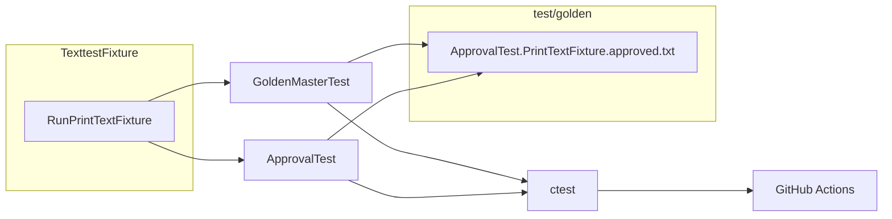

# Golden Master(Approval) 회귀 테스트 설계·구현 보고서

작성일: 2026-05-19

## 1. 작업 개요

본 보고서는 `TVController` 모듈에 대해 **Texttest 스타일 출력 기반 Golden Master(Approval) 회귀 테스트**를 설계·구현한 결과를 `Report` 시리즈 형식으로 정리한 문서입니다.

### 수행 작업

| 항목 | 내용 |
|---|---|
| 분석·설계 대상 | `include/TVController.h`, `src/TVController.cpp`, 기존 `test/ApprovalTest.cpp` 시나리오 |
| 기술 스택 | C++17, Google Test, ApprovalTests.cpp v10.13.0, CMake, ctest |
| 설계 목표 | (1) expected 출력 보관 전략 (2) GTest 파일 비교 (3) CMake/ctest 통합 (4) CI 자동 실행 |
| **본 보고서** | `Report/07.golden-master-approval-test-report.md` |

### 선행 문서와의 관계

| 보고서 | 내용 | 본 보고서와의 연계 |
|---|---|---|
| `Report/01` | 프로젝트 구조·ApprovalTest 개요 | Golden Master 역할 재확인 |
| `Report/04` | 테스트 전략·In/Out of Scope | Approval은 레거시 동작 고정용으로 유지 |
| `Report/05` | TVController 단위 테스트 37건 | Golden Master는 통합 시나리오 1건으로 보완 |
| `Report/06` | 결함 분석·**DEF-BLD-001** Open | 본 작업에서 ApprovalTests Clang 빌드 이슈 **해소** |

### 요청 사항 대비 달성

| 요청 항목 | 달성 내용 |
|---|---|
| expected 출력 파일 생성/보관 전략 | §3 — `test/golden/` 단일 저장소, LF 고정, Git 버전 관리 |
| Google Test 파일 비교 테스트 | §4 — `GoldenMasterTest` + `GoldenFile.h` |
| CMake/ctest 통합 | §5 — `GoldenMasterTest`, `ApprovalTest`, `run_all_tests` |
| CI 자동 실행 구성 | §6 — `.github/workflows/ci.yml` |
| 테스트 코드 + CMake 수정안 + 실행 방법 | §4~§7, §10 |

---

## 2. Golden Master 테스트의 역할

Golden Master(Approval) 테스트는 **여러 리모컨 입력을 연속 적용한 뒤의 최종 출력 문자열**을 스냅샷으로 고정합니다.

| 구분 | 단위 테스트 (`TVControllerTest`) | Golden Master |
|---|---|---|
| 검증 단위 | 메서드·상태 단위 | 시나리오 전체 출력 |
| 목적 | 요구사항·경계값 검증 | 리팩토링 시 **의도하지 않은 동작 변화** 조기 탐지 |
| 의존성 | `DevTuner` Fake | 동일 + 문자열 스냅샷 파일 |

본 프로젝트에서는 **동일 시나리오**를 두 가지 방식으로 검증합니다.

1. **GoldenMasterTest** — 순수 Google Test + 파일 직접 비교 (CI·크로스 플랫폼 기본)
2. **ApprovalTest** — ApprovalTests.cpp 래퍼 (기존 `all_tests` 명칭과 호환)

두 테스트는 **`RunPrintTextFixture()`** 와 **`test/golden/ApprovalTest.PrintTextFixture.approved.txt`** 를 공유합니다.

---

## 3. Expected 출력 파일 생성·보관 전략

### 3.1 디렉터리·파일 규칙

```text
test/
├── TexttestFixture.h / .cpp     # 시나리오 실행 → std::string 반환
├── GoldenFile.h                 # GTest golden 비교 유틸
├── GoldenMasterTest.cpp         # GTest golden 테스트
├── ApprovalTest.cpp             # ApprovalTests 래퍼
└── golden/
    ├── .gitattributes           # *.approved.txt → LF 고정
    └── ApprovalTest.PrintTextFixture.approved.txt
```

| 규칙 | 설명 |
|---|---|
| **저장 위치** | `test/golden/` (소스 트리 내, Git 커밋 대상) |
| **파일명** | `{TestSuite}.{TestName}.approved.txt` (ApprovalTests 네이밍) |
| **줄바꿈** | `.gitattributes`로 `eol=lf` — Windows/Linux CI 일관성 |
| **실패 산출물** | `*.received.txt` — `.gitignore` 제외 (로컬 디버깅용) |
| **바이너리** | 텍스트 비교 (`GoldenFile.h`는 CRLF→LF 정규화 지원) |

### 3.2 Golden 파일 갱신 절차

**의도된 동작 변경** 시에만 golden 파일을 갱신합니다.

#### 방법 A — GTest (`UPDATE_GOLDEN` 환경 변수)

```powershell
cmake -S . -B build -DCMAKE_BUILD_TYPE=Debug
cmake --build build --target GoldenMasterTest

$env:UPDATE_GOLDEN = "1"
.\build\GoldenMasterTest.exe --gtest_filter=GoldenMasterTest.PrintTextFixture
Remove-Item Env:UPDATE_GOLDEN
```

`GoldenFile.h`가 `test/golden/ApprovalTest.PrintTextFixture.approved.txt`를 덮어씁니다.

#### 방법 B — ApprovalTests (수동 승인)

```powershell
.\build\ApprovalTest.exe --gtest_filter=ApprovalTest.PrintTextFixture
# 실패 시 생성된 received.txt 확인 후 approved.txt로 복사·커밋
# test/golden/ApprovalTest.PrintTextFixture.received.txt
#   → test/golden/ApprovalTest.PrintTextFixture.approved.txt
```

> ApprovalTests `StringWriter`는 내용 끝에 `\n`을 한 번 더 추가합니다.  
> `ApprovalTest.cpp`에서 fixture 출력의 **trailing newline을 제거**한 뒤 `verify()` 하도록 맞춰 두 경로의 기대값을 일치시켰습니다.

### 3.3 현재 승인된 출력 (스냅샷)

| 줄 | 의미 |
|---|---|
| `1` | `PressNumber(1)` + `PressConfirm()` → 채널 1 |
| `12` | `PressNumber(1,2)` + `PressConfirm()` → 채널 12 |
| `6 12 37 ` | 채널 12→8→37→8→6 순으로 `PressFavorite()` 토글 후 남은 선호 채널 (오름차순, 공백 구분) |

---

## 4. 테스트 코드 구현

### 4.1 TexttestFixture — 시나리오 생산자

**파일:** `test/TexttestFixture.h`, `test/TexttestFixture.cpp`

```cpp
std::string RunPrintTextFixture();
```

**시나리오 요약:**

1. `DevTuner` 초기 채널 목록 `{1, 4, 12, 56}` 로 생성
2. 한 자리 채널 입력·확인 → 현재 채널 출력
3. 두 자리 채널 입력·확인 → 현재 채널 출력
4. 채널 12, 8, 37, 8, 6 에서 각각 `PressFavorite()` → 선호 목록 출력

`TVController`·`DevTuner`만 사용하며, `Tuner.h` / `remoteKey.h` 는 수정하지 않습니다.

### 4.2 GoldenMasterTest — Google Test 파일 비교

**파일:** `test/GoldenMasterTest.cpp`, `test/GoldenFile.h`

```cpp
TEST(GoldenMasterTest, PrintTextFixture) {
  golden::AssertMatchesGolden(
      RunPrintTextFixture(), "ApprovalTest.PrintTextFixture.approved.txt");
}
```

**`GoldenFile.h` 주요 기능:**

| 기능 | 설명 |
|---|---|
| `GOLDEN_DIR` | CMake compile definition → 절대 경로 `test/golden` |
| `NormalizeNewlines()` | `\r\n` / `\r` → `\n` (플랫폼 차이 흡수) |
| `UpdateGoldenEnabled()` | `UPDATE_GOLDEN` 환경 변수 시 approved 파일 갱신 |

### 4.3 ApprovalTest — ApprovalTests.cpp 래퍼

**파일:** `test/ApprovalTest.cpp`

```cpp
class ApprovalTest : public ::testing::Test {
protected:
  ApprovalTests::SubdirectoryDisposer goldenDir_{"golden"};
};

TEST_F(ApprovalTest, PrintTextFixture) {
  std::string actual = RunPrintTextFixture();
  while (!actual.empty() && (actual.back() == '\n' || actual.back() == '\r')) {
    actual.pop_back();
  }
  ApprovalTests::Approvals::verify(actual);
}
```

- `useApprovalsSubdirectory("golden")` → approved/received 경로를 `test/golden/` 로 통일
- `gtest_discover_tests` 의 `WORKING_DIRECTORY` 를 `test/` 로 설정해 상대 경로 해석 보장

### 4.4 아키텍처 다이어그램



---

## 5. CMake / ctest 통합

### 5.1 CMakeLists.txt 변경 요약

| 타깃 | 소스 | 링크 |
|---|---|---|
| `GoldenMasterTest` | `GoldenMasterTest.cpp`, `TexttestFixture.cpp` | `GTest::gtest_main`, `TVController` |
| `ApprovalTest` | `ApprovalTest.cpp`, `TexttestFixture.cpp` | `ApprovalTests::ApprovalTests`, `GTest::gtest_main`, `TVController` |
| `all_tests` | **ALIAS** → `ApprovalTest` | 기존 README·스크립트 호환 |

**공통 설정:**

```cmake
set(TEST_WORKING_DIR ${CMAKE_SOURCE_DIR}/test)
gtest_discover_tests(GoldenMasterTest WORKING_DIRECTORY ${TEST_WORKING_DIR})
gtest_discover_tests(ApprovalTest WORKING_DIRECTORY ${TEST_WORKING_DIR})
```

**편의 타깃:**

```cmake
add_custom_target(run_all_tests
    COMMAND ${CMAKE_CTEST_COMMAND} --output-on-failure
    WORKING_DIRECTORY ${CMAKE_BINARY_DIR}
    DEPENDS TunerTest TVControllerTest TVControllerMockTest GoldenMasterTest ApprovalTest)
```

### 5.2 ApprovalTests + Clang 빌드 패치 (DEF-BLD-001 해소)

`Report/06`에서 Open 이었던 **`all_tests_NOT_BUILT`** 원인은 ApprovalTests가 plain `clang++` 환경에 MSVC 스타일 `/W4`, `/WX` 를 전달한 것이었습니다.

**조치 (`CMakeLists.txt`):**

```cmake
if(CMAKE_CXX_COMPILER_ID STREQUAL "Clang")
    get_target_property(_approval_copts ApprovalTests COMPILE_OPTIONS)
    if(_approval_copts)
        list(FILTER _approval_copts EXCLUDE REGEX "^/")
        set_target_properties(ApprovalTests PROPERTIES COMPILE_OPTIONS "${_approval_copts}")
    endif()
endif()
```

이후 `ApprovalTest` 타깃이 정상 빌드·실행됩니다.

### 5.3 CTest 실행 결과 (2026-05-19, 로컬 Windows)

| 스위트 | 테스트 수 | 결과 |
|---|---|---|
| `TunerTest` | 13 | Passed |
| `ControllerTest` (`TVControllerTest`) | 37 | Passed |
| `TVControllerMockTest` | 4 | Passed |
| `GoldenMasterTest` | 1 | Passed |
| `ApprovalTest` | 1 | Passed |
| **합계** | **56** | **100% Passed** |

> 이전 `all_tests_NOT_BUILT` 1건은 `ApprovalTest` 정상 빌드로 **제거**되었습니다.

---

## 6. CI 자동 실행 구성

**파일:** `.github/workflows/ci.yml`

| 항목 | 설정 |
|---|---|
| 트리거 | `push` / `pull_request` → `main`, `master`, `dev` |
| 매트릭스 OS | `ubuntu-latest`, `windows-latest` |
| 생성기 | Ubuntu: Ninja / Windows: MinGW Makefiles |
| 컴파일러 | g++ |
| 단계 | checkout → configure → build → `ctest --test-dir build --output-on-failure` |

Golden Master·Approval 테스트는 **별도 설정 없이** 전체 `ctest`에 포함됩니다.

---

## 7. 로컬 실행 방법

### 7.1 빌드

```powershell
cmake -S . -B build -DCMAKE_BUILD_TYPE=Debug
cmake --build build
```

### 7.2 전체 테스트

```powershell
ctest --test-dir build --output-on-failure
```

또는:

```powershell
cmake --build build --target run_all_tests
```

### 7.3 Golden Master만 실행

```powershell
ctest --test-dir build -R "GoldenMaster|ApprovalTest.Print" --output-on-failure
```

### 7.4 개별 실행 파일

```powershell
.\build\GoldenMasterTest.exe --gtest_filter=GoldenMasterTest.PrintTextFixture
.\build\ApprovalTest.exe --gtest_filter=ApprovalTest.PrintTextFixture
# 레거시 명칭 (동일 바이너리)
.\build\all_tests.exe --gtest_filter=ApprovalTest.PrintTextFixture
```

---

## 8. 크로스 플랫폼·운영 시 주의사항

| 이슈 | 원인 | 대응 |
|---|---|---|
| CRLF vs LF | Windows Git/checkout, ApprovalTests received 파일 | `test/golden/.gitattributes` (LF), `GoldenFile.h` 정규화 |
| ApprovalTests 이중 개행 | `StringWriter::Write()` 가 `\n` 추가 | `ApprovalTest`에서 trailing newline 제거 후 `verify` |
| Golden 파일 끝 공백 | 선호 채널 줄 `"6 12 37 \n"` (37 뒤 공백) | 스냅샷 갱신 시 diff 주의 |
| `UPDATE_GOLDEN` 오용 | CI에서 설정 시 스냅샷 덮어쓰기 | CI 워크플로에는 **미설정** (로컬 전용) |

---

## 9. 산출물 목록

| 파일 | 역할 |
|---|---|
| `test/TexttestFixture.h` | 시나리오 함수 선언 |
| `test/TexttestFixture.cpp` | Texttest 스타일 시나리오 구현 |
| `test/GoldenFile.h` | GTest golden 파일 비교·갱신 유틸 |
| `test/GoldenMasterTest.cpp` | GTest Golden Master 테스트 |
| `test/ApprovalTest.cpp` | ApprovalTests 래퍼 |
| `test/golden/ApprovalTest.PrintTextFixture.approved.txt` | 승인된 expected 출력 |
| `test/golden/.gitattributes` | golden 파일 LF 고정 |
| `CMakeLists.txt` | 타깃·ctest·Clang 패치·`run_all_tests` |
| `.github/workflows/ci.yml` | GitHub Actions CI |
| `.gitignore` | `*.received.txt` 제외 |
| `Report/07.golden-master-approval-test-report.md` | **본 보고서** |

---

## 10. 결론

`TVController`에 대해 **TexttestFixture 기반 Golden Master 회귀 테스트**를 설계·구현했습니다. expected 출력은 `test/golden/` 에 단일 보관하고, **Google Test 직접 비교**와 **ApprovalTests** 가 동일 시나리오·동일 파일을 공유합니다. CMake `gtest_discover_tests`·`run_all_tests`·GitHub Actions CI로 **자동 검증**이 가능하며, 로컬 기준 **ctest 56건 전부 Green** 입니다.

`Report/06`의 **DEF-BLD-001**(`ApprovalTests` Clang 빌드 실패)은 CMake compile-option 필터링으로 **해소**되었고, Golden Master 파이프라인은 프로덕션 리팩토링 시 **레거시 통합 동작**을 보호하는 안전망으로 활용할 수 있습니다.

---

## 11. 후속 권장 사항

| 우선순위 | 항목 | 설명 |
|---|---|---|
| P2 | 시나리오 확장 | 채널 검색·업/다운 등 미구현 기능 반영 시 golden 추가 |
| P2 | `docs/analysis.md` 갱신 | 디렉터리 구조·실행 명령을 본 구현과 동기화 |
| P3 | ApprovalTests 단일화 검토 | GTest golden만 CI에 두고 Approval은 로컬 optional로 분리 가능 |
