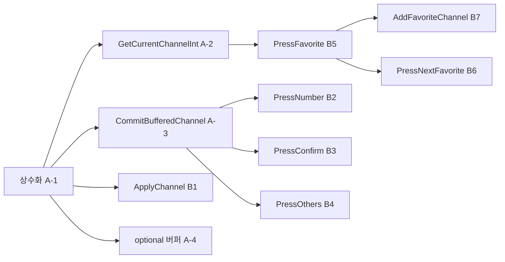

# TVController 모던 C++ 리팩토링 계획 보고서

작성일: 2026-05-19

## 1. 작업 개요

본 보고서는 `TVController`(`include/TVController.h`, `src/TVController.cpp`)에 대한 **단계별 모던 C++ 리팩토링 계획**을 정리한 문서입니다. 각 단계는 **커밋 단위로 분리**하며, **테스트 Green 상태에서만** 진행하는 것을 전제로 합니다.

### 수행 작업

| 항목 | 내용 |
|---|---|
| 계획 대상 | `TVController` 공개·비공개 API 및 `src/TVController.cpp` 전 메서드 |
| 계획 관점 | 조건 분기 축소·중복 제거, 타입/정책 분리, 매직 넘버 상수화, C++17 스타일 |
| 상세 분석 근거 | `docs/code_quality_report.md`, `docs/requirements_analysis.md` |
| **본 보고서** | `Report/08.tvcontroller-refactoring-plan-report.md` |

### 제약 조건

| 제약 | 설명 |
|---|---|
| `Tuner.h` 수정 금지 | `Tuner` 인터페이스·구조체 정의 변경 불가 |
| `remoteKey.h` 수정 금지 | enum/구조체 정의 변경 불가 (기존 값으로 맵·디스패치만 허용) |
| 채널 범위 | 일반 채널 `0` ~ `99` |
| 진행 조건 | 매 커밋 후 `cmake --build` + `ctest` **전체 Green** |

### 선행 문서와의 관계

| 보고서 / 문서 | 내용 | 본 보고서와의 연계 |
|---|---|---|
| `Report/03` | 코드 품질·SOLID·매직 넘버 분석 | 문제점·우선순위의 근거 |
| `Report/02` | 요구사항·경계값·30+ 테스트 시나리오 | FSM·선호 채널·향후 검색/업다운 확장 |
| `Report/05` | TVController 단위 테스트 37건 | 단계별 회귀 검증 대상 |
| `Report/07` | Golden Master·Approval 56 tests | 문자열 스냅샷 회귀 필수 |
| `docs/code_quality_report.md` | 상세 품질 분석 | §3~§6 인용·요약 |
| `docs/requirements_analysis.md` | 구현 관점 요구사항 | 메서드별 기대 동작 |

### 베이스라인 (작성 시점)

| 항목 | 상태 |
|---|---|
| 빌드 | `build/` 디렉터리 CMake 구성 완료 |
| 테스트 | **56/56 passed** (`TunerTest`, `TVControllerTest`, `TVControllerMockTest`, `GoldenMasterTest`, `ApprovalTest`) |
| `PressNextFavorite` wrap | `*FavoriteChannels.begin()` 사용 — UB(`end()` 역참조) **이미 수정됨** |
| `PressNumber` 컴파일 오류 문자 | 현재 소스에 **없음** (`Report/03` 시점 이슈는 해소된 것으로 판단) |

---

## 2. 현재 구현 스냅샷

### 2.1 클래스 책임 (SRP 관점)

| 책임 | 담당 메서드 | 상태 변수 |
|---|---|---|
| 숫자 입력 FSM | `PressNumber`, `PressConfirm`, `PressOthers` | `ChannelBuffer` (센티널 `-1`) |
| 채널 유효성·튜너 적용 | `ApplyChannel`, `IsValidChannel` | `Tuner& tuner` |
| 선호 채널 CRUD·토글 | `PressFavorite`, `AddFavoriteChannel` | `FavoriteChannels` |
| 선호 채널 순환 탐색 | `PressNextFavorite` | 정렬된 `FavoriteChannels` |

### 2.2 메서드별 라인 수·분기 (현재)

| 메서드 | 대략 라인 | 분기 복잡도 | 주요 스멜 |
|---|---|---|---|
| `ApplyChannel` | 5 | 낮음 | 단일 guard |
| `PressNumber` | 8 | 낮음 | `ChannelBuffer == -1` |
| `PressConfirm` | 6 | 낮음 | 버퍼 유무 |
| `PressOthers` | 1 | 없음 | — |
| `PressFavorite` | 10 | 중간 | if/else + erase-remove + sort |
| `PressNextFavorite` | 9 | 중간 | empty return, 삼항 wrap |
| `AddFavoriteChannel` | 5 | 낮음 | `push_back` + `sort` 중복 |

### 2.3 반복 패턴 (Duplicated Code)

```cpp
// 패턴 A: 버퍼 확정 (PressNumber 2자리 / PressConfirm)
int SelectedChannel = ...;
ChannelBuffer = -1;
ApplyChannel(SelectedChannel);

// 패턴 B: 선호 채널 추가 후 정렬 (PressFavorite else / AddFavoriteChannel)
FavoriteChannels.push_back(...);
std::sort(FavoriteChannels.begin(), FavoriteChannels.end());

// 패턴 C: 현재 채널 파싱 (PressFavorite / PressNextFavorite)
int CurrentChannel = std::stoi(tuner.getCurrentCH());
```

### 2.4 매직 넘버 정리

| 값 | 의미 | 상수화 권장명 |
|---|---|---|
| `-1` | 숫자 버퍼 없음 | `kNoBufferedDigit` 또는 `std::nullopt` |
| `0`, `99` | 유효 채널 범위 | `kMinChannel`, `kMaxChannel` |
| `10` | 2자리 십진 합성 | `kDecimalBase` |

---

## 3. 공통 검증 방법

### 3.1 빌드·테스트 명령 (PowerShell)

```powershell
cmake --build c:\DEV\TDD_TV_05\build
ctest --test-dir c:\DEV\TDD_TV_05\build --output-on-failure
```

또는 빌드 디렉터리에서:

```powershell
cmake --build build
ctest --test-dir build --output-on-failure
```

편의 타깃: `cmake --build build --target run_all_tests`

### 3.2 단계별 공통 체크리스트

```
[ ] git diff에 Tuner.h, remoteKey.h 없음
[ ] cmake --build build — 오류 0
[ ] ctest --test-dir build --output-on-failure — 56/56
[ ] GoldenMasterTest + ApprovalTest 통과 (문자열 스냅샷)
[ ] 의도한 동작 변경 없음 (리팩토링만)
```

### 3.3 영역별 회귀 테스트 매핑

| 영역 | 대표 테스트 |
|---|---|
| 숫자 입력 FSM | `ControllerTest.PressNumber_*`, `PressConfirm_*`, `PressOthers_*` |
| 선호 채널 | `PressFavorite_*`, `PressNextFavorite_*`, `AddFavoriteChannel_*` |
| Mock·문자열 | `TVControllerMockTest.*` |
| Golden/Approval | `GoldenMasterTest.PrintTextFixture`, `ApprovalTest.PrintTextFixture` |
| Tuner 경계 | `TunerTest.ValidChannel_*`, `InvalidChannel_*` |

---

## 4. Phase A — 공통 인프라 (동작 동일, 커밋 분리)

모든 메서드가 공유하는 기반을 **먼저** 깔고, 이후 메서드별 구조 개선을 진행합니다.

### A-1. 채널·버퍼 상수 (`constexpr`)

| # | 체크리스트 |
|---|------------|
| A-1.1 | `namespace tv { constexpr int kMinChannel = 0; constexpr int kMaxChannel = 99; }` 추가 (`TVConstants.h` 또는 `TVController.h`) |
| A-1.2 | `constexpr int kNoBufferedDigit = -1;`, `constexpr int kDecimalBase = 10;` |
| A-1.3 | `IsValidChannel` → `ch >= kMinChannel && ch <= kMaxChannel` |
| A-1.4 | `-1` 리터럴을 `kNoBufferedDigit`로 치환 |

**검증:** `TVControllerTest` 전체, Mock, Golden/Approval

**커밋 예:** `refactor: add channel and buffer constants`

---

### A-2. `GetCurrentChannelInt()` 추출

| # | 체크리스트 |
|---|------------|
| A-2.1 | `int GetCurrentChannelInt() const` — `std::stoi(tuner.getCurrentCH())` 단일화 |
| A-2.2 | `PressFavorite`, `PressNextFavorite`에서 중복 제거 |

**검증:** `PressFavorite_*`, `PressNextFavorite_*`, `TVControllerMockTest.PressFavorite_GetsCurrentCH`

**커밋 예:** `refactor: extract GetCurrentChannelInt`

---

### A-3. 버퍼 확정 헬퍼 `CommitBufferedChannel`

| # | 체크리스트 |
|---|------------|
| A-3.1 | `void CommitBufferedChannel(int channel)` — 버퍼 클리어 + `ApplyChannel` |
| A-3.2 | `PressConfirm` → `CommitBufferedChannel(ChannelBuffer)` |
| A-3.3 | `PressNumber` 2자리 분기 → `CommitBufferedChannel(ChannelBuffer * kDecimalBase + ch)` |

**검증:** `PressNumber_TwoDigits*`, `PressNumber_ThreeDigits*`, `PressConfirm_*`

**커밋 예:** `refactor: extract CommitBufferedChannel`

---

### A-4. (선택) C++17 `std::optional<int>` 버퍼

| # | 체크리스트 |
|---|------------|
| A-4.1 | `int ChannelBuffer` → `std::optional<int> bufferedDigit_` |
| A-4.2 | `has_value()` / `reset()` 로 `-1` 센티널 제거 |
| A-4.3 | A-3 완료 **이후** 별도 커밋 |

**검증:** A-3과 동일 + `PressOthers_*`

**커밋 예:** `refactor: use optional for digit buffer`

---

## 5. Phase B — 메서드별 리팩토링 계획

### 5.1 `ApplyChannel(int ch)` — 채널 적용 정책

**역할:** 유효성 검사 + `tuner.setCH(std::to_string(ch))`

| 단계 | 커밋 단위 | 체크리스트 | 검증 |
|---|---|---|---|
| B1-1 | 상수 사용 | A-1 `kMin`/`kMax` 적용 | invalid 채널 예외, `0`/`99` |
| B1-2 | 함수 분해 | `ValidateChannel(int)` + `WriteChannelToTuner(int)`; `ApplyChannel`은 조합만 | Mock `setCH` 인자 |
| B1-3 | (중기) | private struct로 정책 캡슐화 — 별도 인터페이스 클래스는 규모상 생략 가능 | Green 유지 |

**조건 분기:** 단일 `if` — 추가 축소 여지 적음. **정책 분리**가 핵심.

---

### 5.2 `PressNumber(int ch)` — 숫자 입력 FSM

**요구사항 요약** (`Report/02`, `docs/requirements_analysis.md`):

- 버퍼 비어 있음 → 첫 자리 저장
- 버퍼 있음 → `first * 10 + second` 즉시 확정, 버퍼 초기화
- 연속 4자리 → `12`, `34` 순차 적용
- 홀수 자리 → 마지막 1자리는 Confirm 또는 Others로 처리
- `0`, `7` → 채널 `7`, `setCH("7")` (선행 0 제거)

| 단계 | 커밋 단위 | 체크리스트 | 검증 |
|---|---|---|---|
| B2-1 | 상수·헬퍼 | `kDecimalBase`, `CommitBufferedChannel` (A-3) | `PressNumber1`, `12`, `1234`, `456+Confirm`, `07` |
| B2-2 | early return | `if (!buffered) { save; return; }` — else 중첩 제거 | 동일 |
| B2-3 | 합성 분리 | `int ComposeTwoDigitChannel(int first, int second)` | `12`, `00`, `99` |
| B2-4 | (선택) digit 검증 | `IsValidDigit(ch)` 0~9 — **테스트 추가 후** | requirements §3 |
| B2-5 | (확장) FSM | `enum class InputState` + `OnDigit(int)` — 3자리·검색 확장 시 | Golden/Approval |

**C++17 FSM 스케치 (동작 동일 유지):**

```cpp
enum class DigitBufferState { Empty, OneDigitPending };

void TVController::OnFirstDigit(int d) { bufferedDigit_ = d; }
void TVController::OnSecondDigit(int d) {
  CommitBufferedChannel(ComposeTwoDigitChannel(*bufferedDigit_, d));
}
```

---

### 5.3 `PressConfirm()` — 버퍼 확정

| 단계 | 커밋 단위 | 체크리스트 | 검증 |
|---|---|---|---|
| B3-1 | 헬퍼 사용 | `if (buffered) CommitBufferedChannel(*buffered);` | `PressConfirm_WithoutBuffered*`, `456+Confirm` |
| B3-2 | guard clause | 빈 버퍼 즉시 `return` | Confirm 단독 no-op |

---

### 5.4 `PressOthers()` — 버퍼 폐기

| 단계 | 커밋 단위 | 체크리스트 | 검증 |
|---|---|---|---|
| B4-1 | 의미 이름 | `ClearDigitBuffer()` private; `PressOthers` 한 줄 위임 | `PressOthers_*`, `456+Others+Confirm` |
| B4-2 | (확장) | README 업/다운·검색 시 `CancelPendingInput()` 통합 | 신규 시나리오 테스트 후 |

---

### 5.5 `PressFavorite()` — 선호 채널 토글

| 단계 | 커밋 단위 | 체크리스트 | 검증 |
|---|---|---|---|
| B5-1 | A-2 적용 | `GetCurrentChannelInt()` | `PressFavorite_*`, Mock |
| B5-2 | Store 헬퍼 | `RemoveFavorite(int)`, `InsertSortedUnique(int)` | sort 중복 제거 |
| B5-3 | early return | `if (IsFavorite) { Remove; return; } InsertSortedUnique` | 토글 2회, 정렬·유일 |
| B5-4 | (선택) | `FavoriteChannelStore` 클래스 분리 | `AddFavoriteChannel_*` 포함 |

**`InsertSortedUnique` 예시:**

```cpp
void TVController::InsertSortedUnique(int ch) {
  if (IsFavorite(ch)) return;
  FavoriteChannels.push_back(ch);
  std::sort(FavoriteChannels.begin(), FavoriteChannels.end());
}
```

---

### 5.6 `PressNextFavorite()` — sorted 순환 네비게이션

**요구:** `upper_bound`로 현재보다 큰 최소 선호 채널; 없으면 가장 작은 값으로 wrap (`6→12`, `56→1`).

| 단계 | 커밋 단위 | 체크리스트 | 검증 |
|---|---|---|---|
| B6-1 | early return | `empty()` 시 즉시 return | `PressNextFavorite_Empty*` |
| B6-2 | 로직 분리 | `int FindNextFavoriteAfter(int current) const` | wrap 시나리오 |
| B6-3 | 삼항 정리 | `(it != end) ? *it : FavoriteChannels.front()` | Mock `NextFav_CallsSetCH` |
| B6-4 | (확장) | 업/다운 시 next/prev 함수 쌍 | requirements 업/다운 |

**현재 wrap 구현 (정상):**

```cpp
int NextChannel =
    it != FavoriteChannels.end() ? *it : *FavoriteChannels.begin();
```

---

### 5.7 `AddFavoriteChannel(int ch)` — 테스트·시드 API

| 단계 | 커밋 단위 | 체크리스트 | 검증 |
|---|---|---|---|
| B7-1 | DRY | `InsertSortedUnique(ch)` 한 줄 | `AddFavoriteChannel_*` 6건 |
| B7-2 | (선택) | `IsValidChannel` 선행 — 테스트 없으면 보류 | invalid 정책 확정 후 |

---

### 5.8 헤더 정리 (`TVController.h`)

| 단계 | 커밋 단위 | 체크리스트 | 검증 |
|---|---|---|---|
| H-1 | include | 미사용 `<iostream>` 제거 | 빌드 |
| H-2 | C++17 | `[[nodiscard]]` on `GetFavoriteChannels()` | 컴파일 |
| H-3 | 캡슐화 | `protected` → `private` (하위 클래스 없을 때) | 전체 ctest |
| H-4 | OCP 스켈레톤 | `OnKey(remoteKey)` + `unordered_map` — **enum 정의 변경 없이** | 신규 키는 맵 행만 |

---

## 6. 권장 커밋 순서



| 순서 | 커밋 메시지 예 | 주요 영향 |
|---|---|---|
| 1 | `refactor: add channel and buffer constants` | 전역 |
| 2 | `refactor: extract CommitBufferedChannel` | `PressNumber`, `PressConfirm` |
| 3 | `refactor: extract GetCurrentChannelInt` | `PressFavorite`, `PressNextFavorite` |
| 4 | `refactor: favorite list InsertSortedUnique` | `PressFavorite`, `AddFavoriteChannel` |
| 5 | `refactor: extract FindNextFavoriteAfter` | `PressNextFavorite` |
| 6 | `refactor: simplify PressNumber with early return` | `PressNumber` |
| 7 | `refactor: use optional for digit buffer` | 입력 FSM 전체 |
| 8 | `chore: remove unused iostream, nodiscard` | 헤더 |

---

## 7. 메서드 × 기법 매트릭스

| 메서드 | 조건 축소 | 중복 제거 | 타입/정책 분리 | 매직 넘버 / C++17 |
|---|---|---|---|---|
| `ApplyChannel` | 단일 guard 유지 | — | `Validate` + `Write` 분해 | `kMin` / `kMax` |
| `PressNumber` | early return | `CommitBufferedChannel`, `ComposeTwoDigit` | `InputState` / `optional` | `kDecimalBase` |
| `PressConfirm` | guard clause | `CommitBufferedChannel` | — | `kNoBufferedDigit` |
| `PressOthers` | — | `ClearDigitBuffer` | — | — |
| `PressFavorite` | 토글 early return | `InsertSortedUnique`, `RemoveFavorite` | Store 분리(선택) | `GetCurrentChannelInt` |
| `PressNextFavorite` | empty early return | `FindNextFavoriteAfter` | wrap 정책 함수 | `upper_bound` 유지 |
| `AddFavoriteChannel` | — | `InsertSortedUnique` | Store 위임 | — |

---

## 8. 타입·정책 분리 전략 (중·장기)

현재 규모(7 메서드, 56 테스트)에서는 **전략 패턴 전면 도입은 과설계**일 수 있습니다. README 확장(채널 검색·업/다운)이 확인된 경우 아래 순으로 적용하는 것이 비용 대비 효과가 큽니다.

### 8.1 단기 (private 헬퍼·소형 분리)

| 기법 | 적용 대상 |
|---|---|
| 함수 분해 | `CommitBufferedChannel`, `ComposeTwoDigit`, `FindNextFavoriteAfter` |
| Store 캡슐화 | `InsertSortedUnique`, `RemoveFavorite` |
| `constexpr` | 채널 범위, 버퍼 센티널, 십진 자릿수 |

### 8.2 중기 (C++17)

| 기법 | 적용 대상 |
|---|---|
| `std::optional<int>` | 숫자 버퍼 (`-1` 센티널 제거) |
| `enum class InputState` | 3자리·검색 FSM 확장 |
| `[[nodiscard]]` | `GetFavoriteChannels()` |

### 8.3 장기 (OCP — README 미구현 기능)

| 기법 | 적용 대상 | 제약 |
|---|---|---|
| `unordered_map<remoteKey, Handler>` | 리모컨 키 디스패치 | `remoteKey.h` **정의 변경 없음** |
| `std::variant` FSM | 검색 결과·업/다운 상태 | 동작 변경 시 Golden 갱신 |
| `FavoriteChannelStore` | 선호·검색 결과 목록 | 정렬·unique 유지 계약 |

### 8.4 전략 패턴 (참고 — 필요 시만)

| 전략 | 역할 |
|---|---|
| `IChannelApplicator` | `IsValid` + `tuner.setCH` |
| `IFavoriteStore` | sorted unique insert/remove/contains/next |
| `IDigitInputPolicy` | 1/2/3자리·선행 0 규칙 |

`TVController`는 전략을 조합하는 **Facade**로 축소하는 형태를 권장합니다.

---

## 9. 하지 말 것 (제약·과설계)

| 항목 | 이유 |
|---|---|
| `Tuner.h` / `remoteKey.h` 구조체·enum 정의 변경 | 프로젝트 제약 |
| `FavoriteChannels` → `unordered_set` | 정렬·`upper_bound` 계약 깨짐 |
| 다중 인터페이스 전면 도입 | 현 규모 대비 과설계 |
| digit 검증·invalid `AddFavorite` (테스트 없이) | 동작 변경 — Red→Green TDD 후 |
| 리팩토링 중 Golden 미검증 | 문자열 회귀 누락 위험 |

---

## 10. 요약 및 다음 단계

### 10.1 요약

1. **먼저** Phase A: 상수화, `CommitBufferedChannel`, `GetCurrentChannelInt`, `InsertSortedUnique` — 분기·중복을 줄이면서 **동작 동일** 유지.
2. **그다음** Phase B: 메서드별 early return, `ComposeTwoDigit`, `FindNextFavoriteAfter`.
3. **`optional`·Store 분리·`remoteKey` 디스패치**는 Green 유지하며 README 확장(검색·업/다운) 직전에 적용.
4. **매 커밋** `cmake --build` + `ctest` 56건 전체 확인.

### 10.2 권장 즉시 착수 항목

| 우선순위 | 항목 | 예상 커밋 |
|---|---|---|
| 1 | A-1 상수화 | 1 |
| 2 | A-3 `CommitBufferedChannel` | 1 |
| 3 | A-2 `GetCurrentChannelInt` + B5-2 `InsertSortedUnique` | 1~2 |
| 4 | B6-2 `FindNextFavoriteAfter` | 1 |

### 10.3 산출물 위치

| 문서 | 경로 |
|---|---|
| 본 계획 보고서 | `Report/08.tvcontroller-refactoring-plan-report.md` |
| 코드 품질 상세 | `docs/code_quality_report.md` |
| 요구사항 상세 | `docs/requirements_analysis.md` |
| 구현 대상 | `include/TVController.h`, `src/TVController.cpp` |

---

## 11. 참고 코드 위치

| 항목 | 파일:라인 (작성 시점) |
|---|---|
| 채널 적용 | `src/TVController.cpp:5-9` |
| 숫자 입력 FSM | `src/TVController.cpp:11-19` |
| 확인·기타 버튼 | `src/TVController.cpp:21-29` |
| 선호 토글 | `src/TVController.cpp:31-41` |
| 다음 선호 | `src/TVController.cpp:43-52` |
| 테스트 API | `src/TVController.cpp:54-59` |
| 유효 채널 | `include/TVController.h:40` |
| 버퍼 센티널 | `include/TVController.h:24` |

---

*본 문서는 모던 C++ 리팩토링 코칭 세션 산출물을 `Report` 시리즈 형식으로 정리한 것입니다. 실제 패치 적용 시 본 보고서의 커밋 순서·체크리스트를 따르며, 각 단계 후 §3 검증 명령을 실행합니다.*
