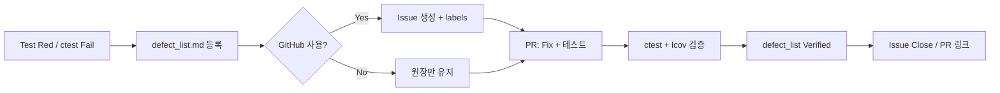

# 결함 관리 보고서 (Defect Management)

| 문서 정보 | 내용 |
|-----------|------|
| 프로젝트 | TDD_TV_05 |
| 모듈 | `TVController`, `Tuner`, 테스트 인프라 |
| 문서 버전 | 1.0 |
| 작성일 | 2026-05-19 |
| 관련 문서 | `docs/defect_list.md`, `docs/requirements_analysis.md`, `docs/test_plan.md` |
| 결함 원장 | `docs/defect_list.md` (개별 결함 상세·상태) |

본 문서는 **결함 분류 체계**, **보고서 템플릿**, **품질 메트릭 수집 계획**, **(선택) GitHub Issues 연동**을 정의한다. 개별 결함의 재현·수정 이력은 `defect_list.md`를 단일 원장(Single Source of Truth)으로 유지한다.

---

## 1. 결함 분류 체계

### 1.1 Severity 정의

| Severity | 정의 | 릴리스 영향 | 대응 SLA (권장) |
|----------|------|-------------|-----------------|
| **Critical** | 프로세스 크래시, 미정의 동작(UB), 핵심 모듈 빌드 불가, 데이터 손상 | 릴리스 **차단** | 즉시 수정·Hotfix |
| **Major** | 요구사항 핵심 기능 불능, 전체 CI/CTest 실패, 회귀 테스트 다수 실패 | 릴리스 **조건부** (워크어라운드 시 예외) | 1 스프린트 이내 |
| **Minor** | 경계·예외 정책 미구현, 잠재 결함(Latent), 단일 테스트 미작성 | 릴리스 **비차단** (백로그) | 다음 마일스톤 |
| **Info** | 문서·명명·스타일, 개선 제안, 관측만 가능한 이슈 | 없음 | 기록·선택 반영 |

### 1.2 Severity × 영향 매트릭스

**가로축:** 사용자·요구사항 영향 | **세로축:** 기술적 심각도

|  | **높음** (크래시·UB·빌드 불가) | **중간** (기능 오동작·테스트 실패) | **낮음** (엣지·정책 미정) |
|--|-------------------------------|-----------------------------------|---------------------------|
| **프로덕션 코드** (`TVController`, `Tuner` 계약) | **Critical** | **Major** | **Minor** |
| **테스트/빌드 인프라** (`CMake`, ApprovalTests, CTest) | **Major** (전체 게이트 실패 시) | **Major** / **Minor** | **Info** |
| **문서·요구사항 불일치** | **Major** (안전·계약 오해) | **Minor** | **Info** |

**판정 예시 (프로젝트 실측):**

| ID | Severity | 판정 근거 |
|----|----------|-----------|
| DEF-TV-001 | Critical | `PressNextFavorite` wrap 시 `end()` 역참조 → SEH/크래시 |
| DEF-TV-002 | Critical | `TVController.cpp` 비 C++ 토큰 → 핵심 타깃 빌드 불가 |
| DEF-BLD-001 | Major | `all_tests` 미빌드 → CTest 1건 Not Run (54/55 통과) |
| DEF-TV-003 | Minor | `PressNumber` digit 미검증 — 잠재 버퍼 오염, 테스트 미작성 |

### 1.3 ItemType (보조 분류)

| ItemType | 설명 |
|----------|------|
| Defect (Runtime / UB) | 실행 중 오류·미정의 동작 |
| Build Defect | 컴파일·링크 실패 |
| Test Infrastructure / Build Environment | CTest·타깃·툴체인 문제 |
| Latent Defect / Specification Gap | Red 테스트 없음, 요구사항 E-02 등 정책 미확정 |
| Documentation | 요구·구현·테스트 불일치 |

### 1.4 상태(Status) 전이

```
New → Open → In Progress → Fixed → Verified → Closed
                    ↘ Won't Fix / Deferred
```

| 상태 | 의미 |
|------|------|
| **Open** | 확인됨, 수정 또는 테스트(Red) 대기 |
| **Fixed** | 코드·빌드 수정 완료, 검증 전 |
| **Verified** | 회귀 테스트·커버리지 게이트 통과 |
| **Closed** | 원장에 반영, 이슈(해당 시) 종료 |

---

## 2. 결함 보고서 템플릿

신규 결함 등록 시 아래 필드를 채운 뒤 `docs/defect_list.md`에 추가한다. ID 규칙: `DEF-TV-###` (모듈), `DEF-BLD-###` (빌드/CI).

### 2.1 필드 정의

| 필드 | 필수 | 설명 |
|------|:----:|------|
| **ID** | ○ | `DEF-TV-004` 형식, 순번 증가 |
| **Severity** | ○ | Critical / Major / Minor / Info |
| **ItemType** | ○ | §1.3 참조 |
| **Status** | ○ | Open / Fixed / Verified / Closed |
| **Steps (재현)** | ○ | 번호 목록, 전제 조건·입력·호출 순서 |
| **Expected (기대)** | ○ | 요구사항 ID 또는 `requirements_analysis.md` § 참조 |
| **Actual (실제)** | ○ | 관측 결과, 로그, 실패한 `TEST_F` 이름 |
| **Root Cause (원인)** | △ | 파일·행, 알고리즘·정책 오류 (수정 전에도 기록 가능) |
| **Fix Summary (수정)** | △ | 변경 요약, 커밋 해시 |
| **Verification (검증)** | ○ | 실행 명령, Passed/Failed, 커버리지 스냅샷 |

### 2.2 보고서 본문 템플릿 (복사용)

```markdown
### DEF-TV-XXX

| 필드 | 내용 |
|------|------|
| **ID** | DEF-TV-XXX |
| **Severity** | Critical / Major / Minor / Info |
| **ItemType** | |
| **Status** | Open |
| **Related Req** | C-08, E-02, `requirements_analysis.md` §3 |
| **Related Test** | `ControllerTest.should_...` |

#### 재현 (Steps)

1. (전제) `SetUp`: DevTuner 초기 채널 …
2. `PressNumber(n)` / …
3. `ctest -R "..."` 또는 단위 실행

#### 기대 (Expected)

- (요구사항 문장)
- `getCurrentCH() == "7"` / `setCH` 미호출 / `EXPECT_THROW(..., std::invalid_argument)`

#### 실제 (Actual)

- (관측값, 스택, ctest 출력 일부)

#### 원인 (Root Cause)

- `src/TVController.cpp` Lnn: …

#### 수정 (Fix Summary)

- (변경 내용 1~3문장)
- Commit: `xxxxxxxx`

#### 검증 (Verification)

| 항목 | 명령 / 결과 |
|------|-------------|
| 단위 테스트 | `ctest --test-dir build -R "ControllerTest\|..."` → N/N Passed |
| Mock 테스트 | `TVControllerMockTest` → … |
| 커버리지 | `lcov --summary build/coverage.filtered.info` → line ≥ 90% |
| 회귀 | P0 TEST_F 전부 Green |
```

### 2.3 요구사항·테스트 추적

| 결함 보고 시 기입 | 참조 문서 |
|------------------|-----------|
| 요구 시나리오 | `docs/requirements_analysis.md` §4 (시나리오 1~30) |
| TEST_F ID | `docs/test_plan.md` §3 (C-01, M-03, E-02 등) |
| 경계값 | `docs/test_plan.md` §4 |

---

## 3. 품질 메트릭 수집 계획

### 3.1 메트릭 목록

| 메트릭 | 정의 | 목표 (TVController) | 수집 주기 |
|--------|------|----------------------|-----------|
| **테스트 통과율** | `Passed / (Passed + Failed + Not Run)` × 100% | **100%** (Not Run 0) | PR·일일 빌드 |
| **Line 커버리지** | `src/TVController.cpp` 실행 라인 비율 | **≥ 90%** | PR (gcov 환경) |
| **Branch 커버리지** | 분기 커버리지 | **≥ 85%** | PR |
| **함수 커버리지** | 공개·비공개 멤버 함수 | **100%** | 릴리스 전 |
| **단계별 결함 발견율** | 해당 단계에서 **신규 Open** 결함 수 / 해당 단계 테스트·검토 건수 | 추세 관리 (목표치 없음) | 스프린트 종료 |
| **결함 밀도** | Open+Fixed 결함 수 / KLOC (`TVController.cpp` 기준) | 감소 추세 | 마일스톤 |
| **수정 검증률** | Verified ÷ Fixed × 100% | **100%** | 결함 Close 시 |
| **Critical 잔존** | Open Critical 건수 | **0** (릴리스 게이트) | 릴리스 전 |

### 3.2 테스트 통과율 수집

**범위 (권장 게이트):**

```powershell
cmake --build build
ctest --test-dir build -R "ControllerTest|TVControllerMockTest|TunerTest" --output-on-failure
```

**전체 스위트 (Approval 포함):**

```powershell
ctest --test-dir build --output-on-failure
```

**기록 형식 (검증 이력과 동일):**

| 일자 | 명령 | Passed | Failed | Not Run | 통과율 |
|------|------|--------|--------|---------|--------|
| YYYY-MM-DD | `ctest ...` | 54 | 0 | 1 | 98.2% |

Not Run(`all_tests_NOT_BUILT` 등)은 **통과율 분모에 포함**하고, Major 결함(DEF-BLD-001)과 연동해 추적한다.

### 3.3 단계별 결함 발견율

| 단계 | 활동 | 발견 예상 유형 | 본 프로젝트 사례 |
|------|------|----------------|------------------|
| **단위 (Unit)** | `TVControllerTest`, `TunerTest`, Mock | 로직·경계·UB | DEF-TV-001, DEF-TV-003 |
| **통합 (Integration)** | Controller + Fake/Mock `Tuner` | 협력 계약·문자열 직렬화 | Mock `setCH("7")` vs `"07"` |
| **시스템 (System)** | ApprovalTest, Golden Master | 복합 시나리오 회귀 | (인프라 이슈 시 DEF-BLD-001) |
| **정적/빌드** | 컴파일, `-Wall`, CI | Build Defect | DEF-TV-002 |
| **요구사항 검토** | `requirements_analysis.md` 대조 | Spec Gap | DEF-TV-003 (E-02) |

**발견율 계산 (스프린트):**

```
발견율(단계 X) = (단계 X에서 최초 등록된 결함 수) / (단계 X에서 실행·검토한 테스트 케이스 수)
```

`defect_list.md` 요약 표의 Severity별 건수를 스프린트마다 스냅샷하여 **Critical이 단위에서 조기에 소진**되는지 확인한다.

### 3.4 C++ 커버리지 — gcov / lcov

**전제:** GCC/MinGW/Clang + `--coverage`. MSVC 네이티브는 gcov 미지원 → WSL·MSYS2·Linux CI 사용 (`test_plan.md` §6).

**CMake (현황):** `TVControllerTest`에 `--coverage` 적용 (`CMakeLists.txt` 77–79행).  
**권장:** `TVController` 라이브러리 타깃에도 동일 플래그를 적용해 `TVControllerMockTest` 실행 시 `.gcda` 일관성 확보.

#### 측정 절차 (Bash / WSL / MSYS2)

```bash
cmake -S . -B build -DCMAKE_BUILD_TYPE=Debug
cmake --build build
ctest --test-dir build -R "ControllerTest|TVControllerMockTest" --output-on-failure

lcov --capture --directory build --output-file build/coverage.info
lcov --remove build/coverage.info \
  '*/test/*' '*/googletest/*' '*/gmock/*' '*/ApprovalTests/*' \
  --output-file build/coverage.filtered.info

genhtml build/coverage.filtered.info --output-directory build/coverage_html
lcov --summary build/coverage.filtered.info
```

#### PR·릴리스 게이트 (예시)

| 조건 | 동작 |
|------|------|
| `TVController.cpp` line < 90% | PR 코멘트 + P0/P1 TEST_F 추가 요청 |
| Critical Open > 0 | 병합 차단 |
| `coverage.filtered.info` | `build/coverage_html/index.html` 아티팩트 보관 (선택) |

#### 커버리지–결함 연계

| 미커버 구간 (`test_plan.md` §6.5) | 대응 결함·테스트 |
|-----------------------------------|------------------|
| `PressNextFavorite` wrap | DEF-TV-001, C-13 |
| `PressNumber` invalid digit | DEF-TV-003, E-02, C-11 |
| `ApplyChannel` invalid | C-08, E-01 |

### 3.5 메트릭 대시보드 (최소)

스프린트 종료 시 `defect_list.md` 요약 + 아래 한 줄을 갱신한다.

| 스프린트 | 통과율 | Line Cov. | Open (C/M/m/I) | 신규 | Verified |
|----------|--------|-----------|----------------|------|----------|
| S1 | 98.2% | (측정 TBD) | 0/1/1/0 | 4 | 2 |

---

## 4. (선택) GitHub Issues 연동 워크플로우

이슈 트래커를 쓰지 않아도 `defect_list.md`만으로 운영 가능하다. 팀이 GitHub을 쓰는 경우 아래 매핑을 권장한다.

### 4.1 ID ↔ Issue 매핑

| 원장 (`defect_list.md`) | GitHub |
|-------------------------|--------|
| `DEF-TV-001` | Issue 제목: `[DEF-TV-001] PressNextFavorite wrap UB` |
| Severity | Label: `severity:critical` |
| ItemType | Label: `type:defect`, `type:build` |
| Status | Label + Project 상태 컬럼 |

**권장 Labels**

- `severity:critical`, `severity:major`, `severity:minor`, `severity:info`
- `module:tvcontroller`, `module:tuner`, `module:ci`
- `status:open`, `status:fixed`, `status:verified`

### 4.2 이슈 본문 템플릿

GitHub New Issue 시 §2.2 Markdown을 붙여 넣고, 하단에 링크를 추가한다.

```markdown
## Links
- Defect ledger: docs/defect_list.md#def-tv-xxx
- Requirement: docs/requirements_analysis.md
- Test plan: docs/test_plan.md (C-08)
```

### 4.3 워크플로 (요약)



| 이벤트 | 액션 |
|--------|------|
| Red 테스트 또는 ctest 실패 | `defect_list.md`에 Open 등록, Critical이면 Issue 즉시 생성 |
| Fix PR 머지 | 원장 Status → Fixed, Issue에 PR 링크 |
| `ctest` + lcov 게이트 통과 | Status → Verified → Issue Close |
| Won't Fix | 원장에 사유 기록, Issue `wontfix` label |

### 4.4 PR 체크리스트 (복사용)

```markdown
- [ ] 관련 DEF-ID: DEF-TV-___
- [ ] P0/P1 TEST_F Green (`ctest -R "..."`)
- [ ] `TVController` line coverage ≥ 90% (lcov summary 첨부)
- [ ] `docs/defect_list.md` 상태·검증 이력 갱신
- [ ] (선택) GitHub Issue Closed / 링크
```

### 4.5 GitHub CLI 예시

```bash
gh issue create \
  --title "[DEF-TV-003] PressNumber accepts out-of-range digit" \
  --label "severity:minor,module:tvcontroller,type:defect" \
  --body-file .github/ISSUE_TEMPLATE/defect.md
```

(템플릿 파일은 팀 정책에 따라 `.github/ISSUE_TEMPLATE/`에 §2.2 기반으로 추가)

---

## 5. 역할 및 책임 (QA)

| 역할 | 책임 |
|------|------|
| **QA Lead** | Severity 판정, 메트릭 스프린트 리포트, 게이트 기준 유지 |
| **개발** | Root Cause·Fix, Red→Green, lcov 갭 해소 |
| **리뷰어** | 요구사항 추적(C-*, M-*, E-*) 및 결함 원장 일치 확인 |

---

## 6. 변경 이력

| 버전 | 일자 | 변경 내용 |
|------|------|-----------|
| 1.0 | 2026-05-19 | 최초 작성 — 분류 매트릭스, 보고 템플릿, 메트릭·gcov/lcov, GitHub 워크플로 |
